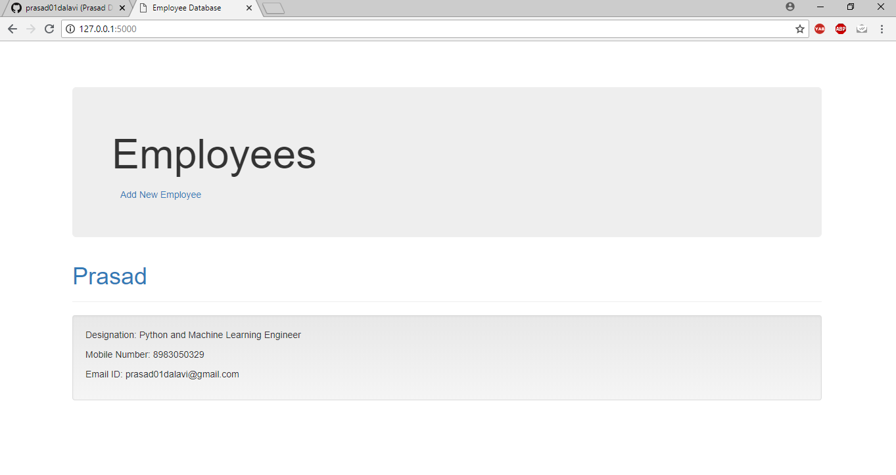
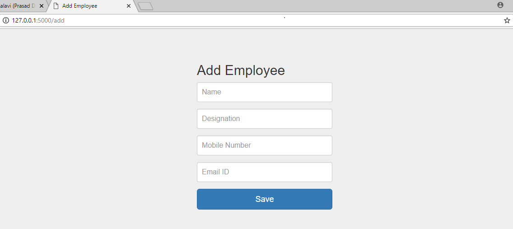
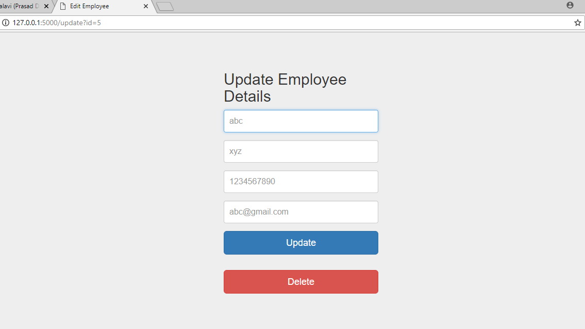

# Python Exercise

## Screenshots:
1. Home Page: 127.0.0.1:5000/
 

  
 

 
2. Add Employee:

  

 
 
3. Update/Delete Employee:
When we click on Employee Name, we will be directed to take an action(update/delete) on it

 

 

